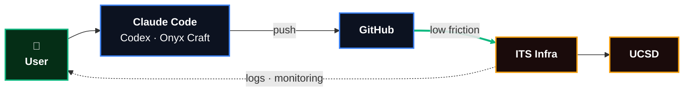
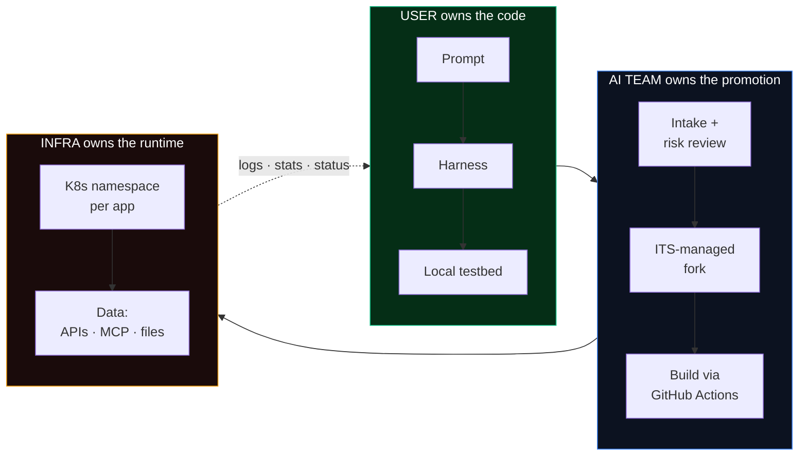

  

    UCSD ITS · Internal Discussion · April 2026
  

  <h1 class="!text-6xl !font-extrabold tracking-tight leading-none mb-6 bg-gradient-to-br from-white via-slate-200 to-emerald-300 bg-clip-text text-transparent">
    Agentic Development at UC San Diego
  </h1>
  

    A framework for citizen developers — what we're proposing, where we want your input
  

  

    Brett Pollak · Workplace Technology Services
  

<!--
Friday meeting. Audience already oriented to agentic dev. Goal: socialize the framework we've converged on, not re-design it. Expect heavy discussion — we have 20–45 min and slides are just prompts.
-->

---
layout: default
class: flex flex-col justify-center
---

01 — The problem

# The train is moving

Users are going to build these agents.

"We can either drive it or have to later catch up." — Adam

**Deans** are hearing it from their staff.

**Cabinet** is hearing it from the deans.

**Researchers** are already doing it — with or without rails.

**Service owners** haven't yet decided how to respond.

The question isn't if. It's with what rails.

<!--
Adam's line captures the thesis. Hugo from today's dean meeting: 70–80% of his office's manual work is "handshake between system A and system B" — exactly what agents automate. Faculty Rajesh has students and wants a custom assistant. Analyst wants Cognos → Tableau → email automated. They will do this with or without us.
-->

---
layout: two-cols-header
class: flex flex-col
---

02 — The shape

# Two tracks, same philosophy

Decoupled for now. Coordinated via architecture meetings. Converge when we've learned.

::left::

  
Formal · Tier 3

  
Enterprise agentic dev

  

    
Joey &amp; Mike on the HR stack

    
Supabase + AWS, streamlined

    
Developers trusted top-to-bottom

    
~1–5 apps / year

  

::right::

  
Informal · Tiers 0–2

  
Citizen agentic dev

  

    
Faculty, staff, researchers, analysts

    
Shared rails, scaled guardrails

    
Trust earned via tier, not assumed

    
~1,200+ attempts / year

  

<!--
Decision from today's meeting: these stay separate but coordinated. Joey/Mike attend our Tuesday sync. Don't burden enterprise with campus-wide guardrails; don't burden citizen with enterprise separation-of-duties. Shared anchor: a single "AGENTS.md for UC-compliant code" document co-authored across both tracks.
-->

---
layout: center
class: text-center
---

03 — The vision

One sentence: user's prompt &rarr; coding agent &rarr; GitHub &rarr; ITS deployment &rarr; UCSD users, with a monitoring loop back to the author.

Low friction is load-bearing. Everything else in this deck is how we keep that promise.

<!--
This is the elevator pitch. The "low friction" edge is the promise to the user. Every other slide answers: how do we keep it low-friction without burning the house down?
-->

---
layout: default
class: flex flex-col
---

04 — The tier model

# From laptop to campus

The further up, the higher the data tier, the more review. The further down, the more invocations, the faster iteration.

  
Tier 0

  
Individual

  
Local · ~1,000+/y

  

    
Own laptop / Jupyter

    
Auto LLM + Onyx keys

    
P1–P2 author's data

    
No publishing

  

  
Tier 1

  
Scattered

  
~200/y

  

    
*.apps.ucsd.edu

    
ITS-managed fork

    
SPA + SQLite / Supabase

    
Quarterly review

  

  
Tier 2

  
Many users

  
~20/y

  

    
*.tritonai.ucsd.edu

    
AI team hands-on

    
P3 gated

    
Rapid ITS Dev

  

  
Tier 3

  
Enterprise

  
~1–5/y

  

    
iPaaS patterns

    
AWS hosted

    
Full SoD

    
Joey &amp; Mike

  

graduate &uarr; &nbsp; or &nbsp; escalate &uarr; &nbsp; or &nbsp; migrate &uarr;

<!--
Tier 0 is new based on David Balderson's feedback — the on-ramp. Tier 3 is where enterprise lives (Joey/Mike HR stack) and is deliberately decoupled for v1. The lateral boundaries matter: crossing them triggers a risk/scope review. The vertical ones matter too: you can stay at your tier indefinitely.
-->

---
layout: default
class: flex flex-col
---

05 — The pipeline

# Who owns what

Three swim-lanes. User never touches the build/deploy path. Infra never touches the code. The AI team is the bridge — enforcing review at the gate, automating everything that can be automated.

<!--
Answers the "who does what" question. User's repo lives in their org; when they want to ship, they fork up and we own it from there. The dotted line back is the observability promise — they see what's happening with their thing without having to ask.
-->

---
layout: default
class: flex flex-col
---

06 — Harness choices

# Three on-ramps, same rails

  
Free tier

  
Open Code + OSS models

  

    
&euro;0 out of pocket

    
Chinese open-weight models (Matthew's testing: minimax 2.5 works)

    
UCSD-branded instructions

    
Clear upgrade path

  

  
Staff onboarding

  
Guided

  
Onyx Craft

  

    
Opinionated — we control the env

    
Auto-config, auto-updates

    
Next.js + consistent UI kit

    
Dashboards, forms, internal tools

  

  
Non-technical builders

  
Power users

  
Claude Code · Codex

  

    
Bring your own chartstring

    
LiteLLM gateway access

    
Full flexibility

    
Researchers with grants

  

  
Devs + researchers

We don't build our own. We ship a setup script that configures the existing harnesses with UCSD skills, AGENTS.md, and gateway credentials.

<!--
Explicit decision from today: no own Claude/Codex fork. Setup script + skills repo. Onyx Craft is the exception because we already own it. Each user lands in the right lane based on who they are and what they have.
-->

---
layout: default
class: flex flex-col justify-center
---

07 — Data access

# The data principle

Users want to automate what they already see in browsers. Blocking agentic access doesn't prevent it — it just drives it underground.

  

    

    
Preferred

  

  
Official API / MCP

  
via TritonAI gateway, vetted, rate-limited, logged.

&rarr;

  

    

    
Acceptable

  

  
Personal token

  
Canvas, Jira, etc. Scoped to the user's own permissions.

&rarr;

  

    

    
Tolerated

  

  
Playwright browser

  
Inside UCSD infra. Only until service owners ship an API.

  

    "Safer to have the kids drinking at home than drinking out in the world."
  

  
— Adam

<!--
The punchline: our job is to make the preferred path easier than the tolerated path. Most UCSD APIs today aren't "gold standard" — consumable outside the team that built them. We need to MCP-ify the catalog, and that requires service-owner partnership.
-->

---
layout: default
class: flex flex-col justify-center
---

08 — Review &amp; protections

# What ITS takes on

  
Automated first pass

  

    
01Sonarqube + Claude Code agent reads the PR

    
02Flags security holes, unusual architecture

    
03Accessibility defaults baked into templates

    
04Feedback directly in the PR, not email

  

  
Manual second pass

  

    
01Resource footprint (CPU, network)

    
02Data-access scope

    
03Operational / business risk

    
04Unit Acceptance of Risk (UISL)

  

  
Default protections

  

    
&#9679; SSO or VPN gate

    
&#9679; Title II accessibility template

    
&#9679; 1Password for secrets

    
&#9679; Runtime env injection

    
&#9679; P4 data blocked at the tier

  

<!--
We take the risk by hosting. That's why we review architecture + security, not bugs. Bugs belong to the user. First 10 apps, review is a meeting — we use those to inform the form questions, then automate.
-->

---
layout: default
class: flex flex-col justify-center
---

09 — Open question for you

# Where should this NOT go?

You're the ones who know where the landmines are. Help us stake out the hazardous ground.

  
Our starting no-go list

  

    
&#9679;P4 regulated data (HIPAA, PCI, FERPA-restricted)

    
&#9679;SOC 2 separation-of-duties audits

    
&#9679;Payment processing

    
&#9679;Credentialing, grades-of-record writes

  

  
Open for your input

  

    
?Systems that should exclude even <em>read</em> access?

    
?Where does "occasional manual access" become dangerous at agent scale?

    
?Which APIs should require elevated review regardless of tier?

    
?What compliance regimes are we underestimating?

  

<!--
Sandra's framing: we win the room by asking them to stake out the hazardous areas from their expertise. This is the highest-leverage slide in the deck — real signal on where we might break something we don't realize we're touching.
-->

---
layout: default
class: flex flex-col justify-center
---

10 — Open question for you

# Which APIs should we MCP-ify first?

Most UCSD APIs aren't consumable outside the team that built them. Each one we turn into an MCP unlocks a class of agent use cases.

  
Our starting priority

  

    
01WSO2 catalog (gateway for many)

    
02Microsoft Graph (email, calendar, files)

    
03Canvas (instructional data)

    
04OFC / Oracle Financials

    
05Quality Build

    
06Google / Gmail API

  

  
Questions for the room

  

    
Which of these unlocks the most for <em>your</em> team?

    
What's missing from this list that you'd use tomorrow?

    
Where are you seeing the most gorilla-automation today?

    
Who's the service-owner we should loop in first?

  

<!--
Each MCP-ification is real engineering on the service-owner side. We get real signal here on prioritization. Also surfaces which service owners need a heads-up conversation before next steps.
-->

---
layout: default
class: flex flex-col justify-center
---

11 — The ask

# Where you come in

We're not asking you to approve this framework. We're asking you to help us sharpen it.

  
01

  
Find the landmines

  
Things we haven't thought of. Where it breaks.

  
02

  
Point at the APIs

  
What your teams wish existed. What's blocking them today.

  
03

  
Take it to your teams

  
Bring back what you hear. We'll fold it in.

  
04

  
Co-author AGENTS.md

  
The UC-compliant-code document. One shared anchor.

Nothing here is cast in stone. Regular touch-points will reshape it.

<!--
Brett's close. Small ask, intentionally. Friday is Round 1 of a series. Design responsibility stays with the AI team. This audience contributes via feedback and socialization.
-->

---
layout: center
class: text-center
---

Discussion

  Over to you.

  
Where should citizen dev <strong class="text-emerald-400">not</strong> go?

  
Which APIs to <strong class="text-emerald-400">MCP-ify</strong> first?

  
What have we <strong class="text-emerald-400">not thought of</strong>?

  
How do we keep the <strong class="text-emerald-400">enterprise track</strong> connected?

brett@ucsd.edu &nbsp;·&nbsp; <a href="https://bpollak.github.io/citizen-dev-proposal">bpollak.github.io/citizen-dev-proposal</a>

